# What is Jomymeet ? 
Jomymeet is the world's best e-learning platform designed to help connecting teachers and students in virtual classrooms via videoconferencing technology.

Jomymeet uses Jitsi meet (open source) video conferenceing library, which comes with the following options:
 1) Screen share
 2) Tile view
 3) Mute all
 4) Disable camera & mute microphone
 5) Chat with emoji
 6) Raise hand
 7) Invite people (share session link)
 8) Video recording (Dropbox)
 9) Share a youtube video
 10) Blur background
 
 and many more ...
 
 Above all Jomymeet can be self hosted at your facility or on the cloud for optimum security.

# How it works ?
A admin person has to enrol studnets by adding their e-mail address, grade and classroom. the admin person is also responsible for creating the timetable for each classroom.
Studnets can then login to their dashboard and connect to their virtual classroom.

# Where is it available ?
Jomymeet is available as a web app (https://jomymeet.com/) as well as android and iOS mobile apps. Check this repo (https://github.com/A-monem/Jomymeet-React)

# How can I test it ?
you can test it by logging in as an ADMIN or by logging in as a STUDENT using the following credentials:
 1) e-mail: admin@jomymeet.com, password: admin123
 2) e-mail: test@jomymeet.com, password: test123
 3) e-mail: test2@jomymeet.com, password: test456

# Built with

## Web Application

* React
* React Router
* Firebase auth/firestore
* Jitsi meet
* Material UI
* Node Express for backend
* Heruko as a host

## Mobile Application
  
  * React Native
  * React Navigation
  * Firebase auth/firestore
  * React-native-elements
  * React-native-jitsi-meet
  * React-native-snap-carousel
  * React-native-elements

# Screenshots

## Android

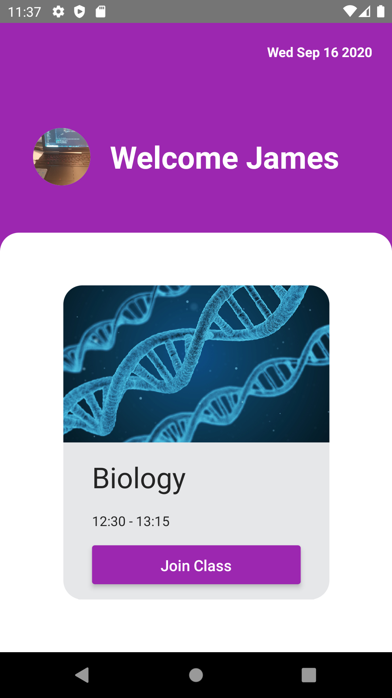

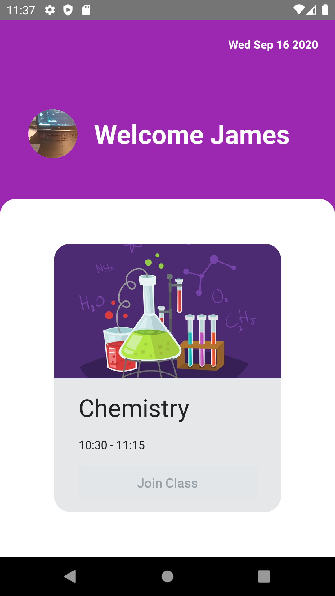

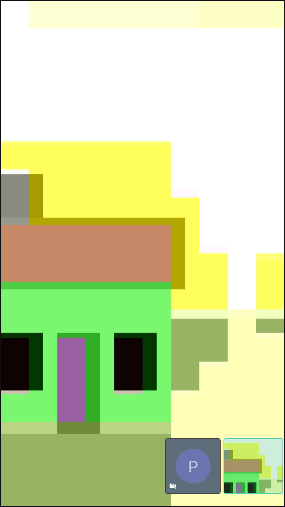

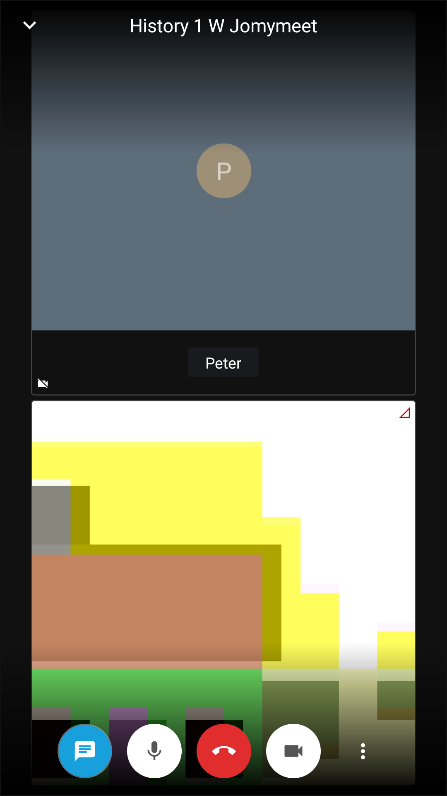

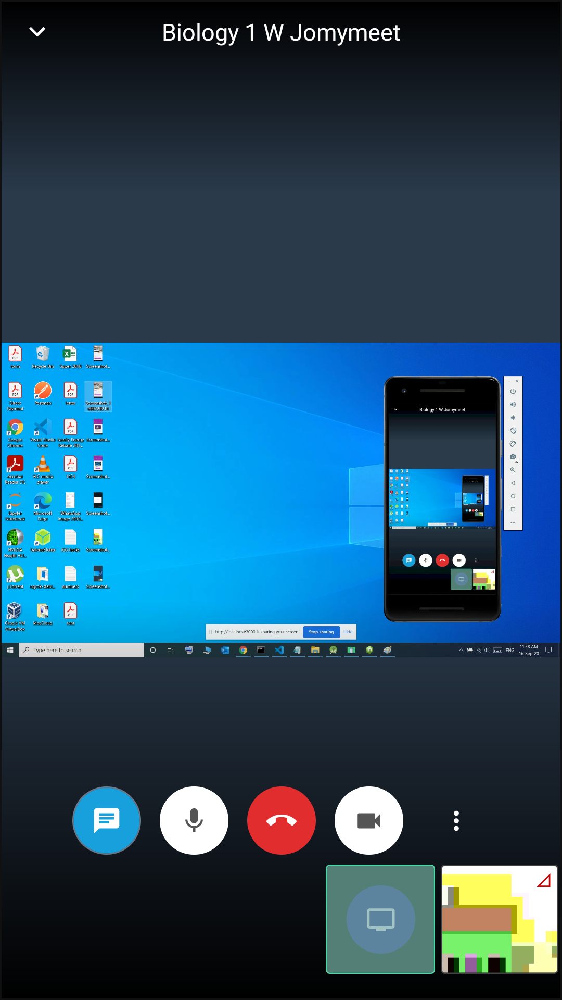

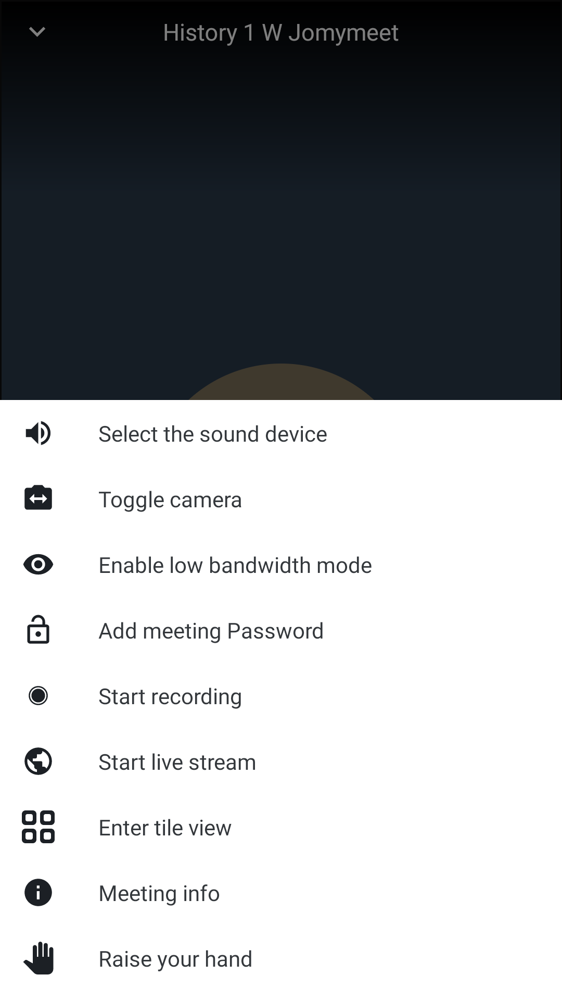

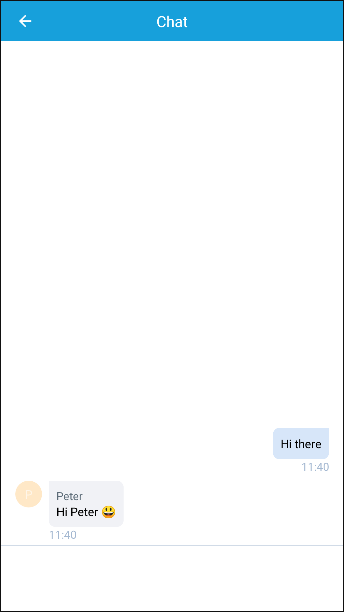

## iOS
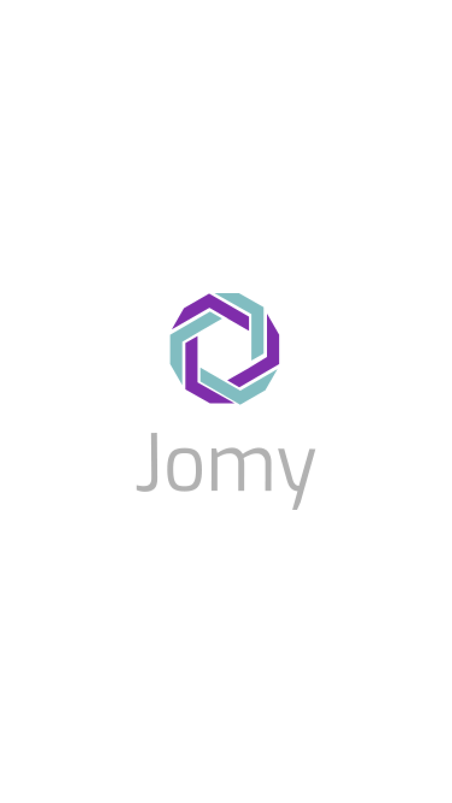

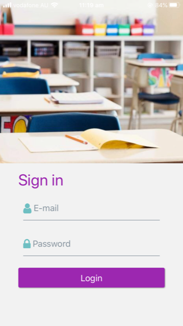

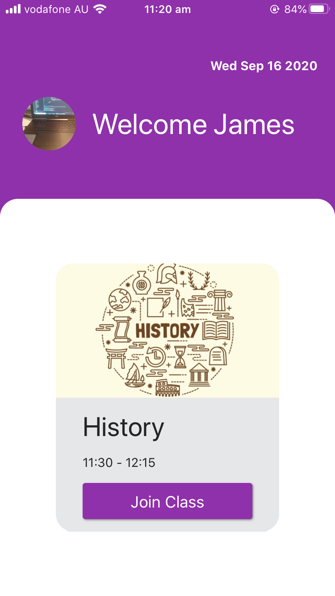

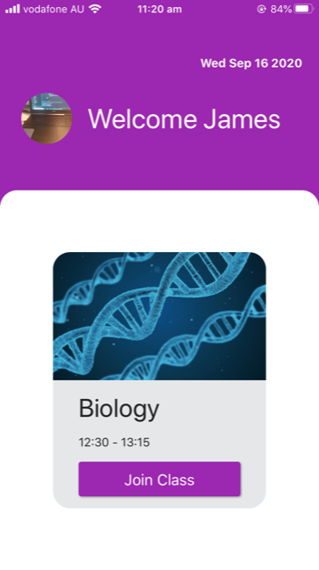

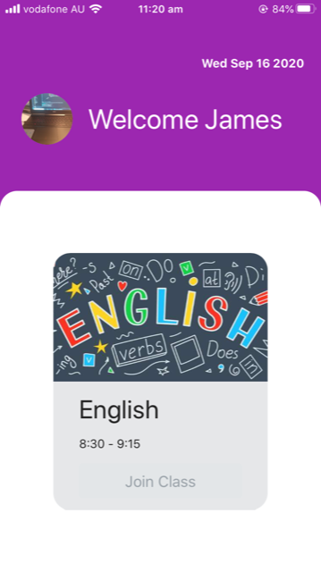

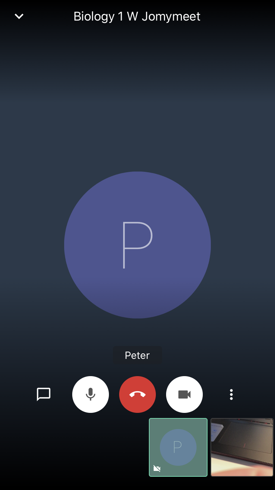

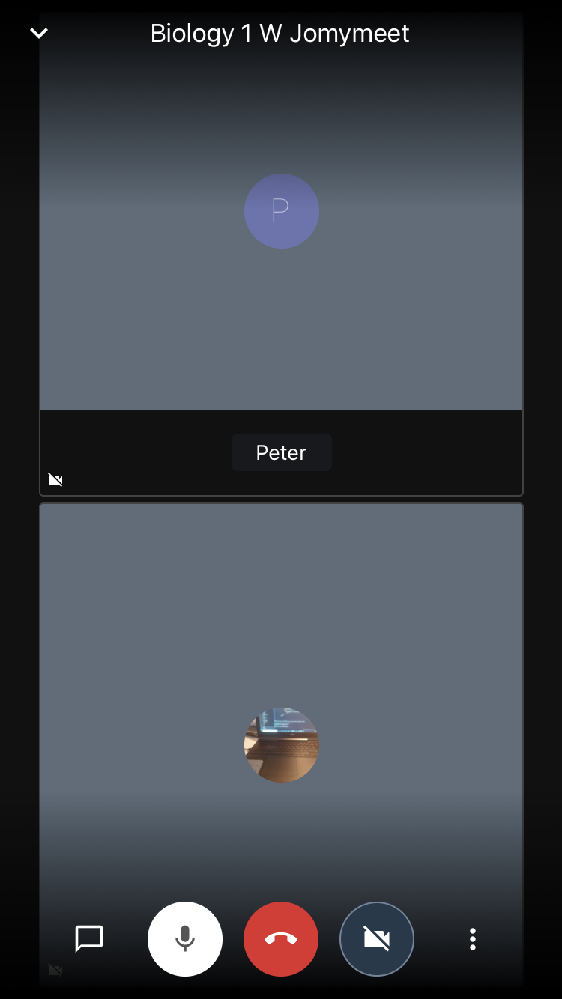

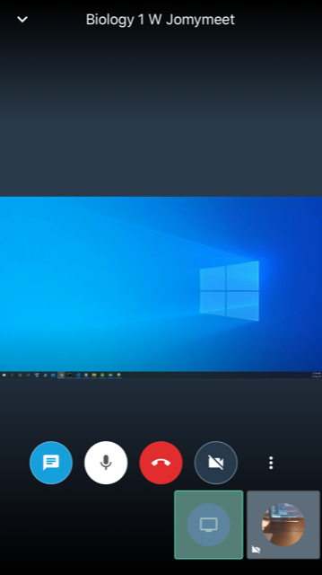

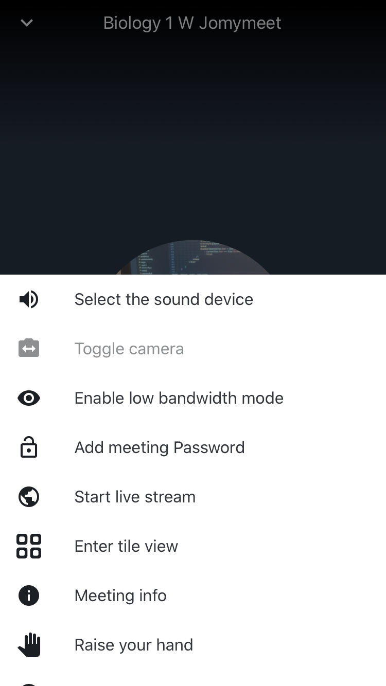

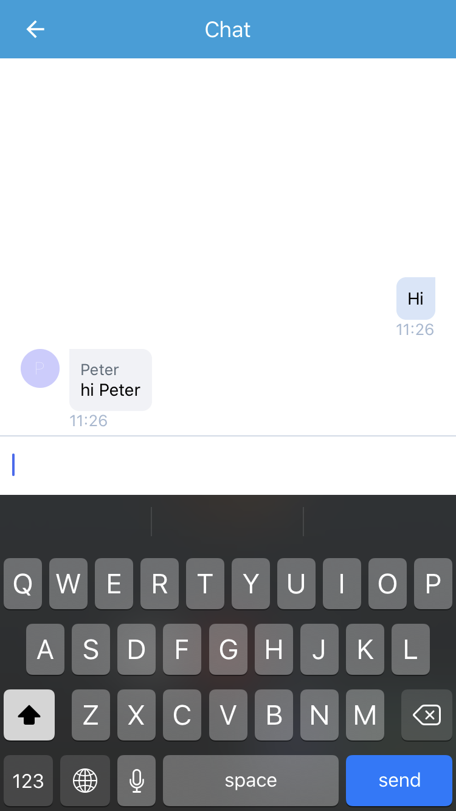
